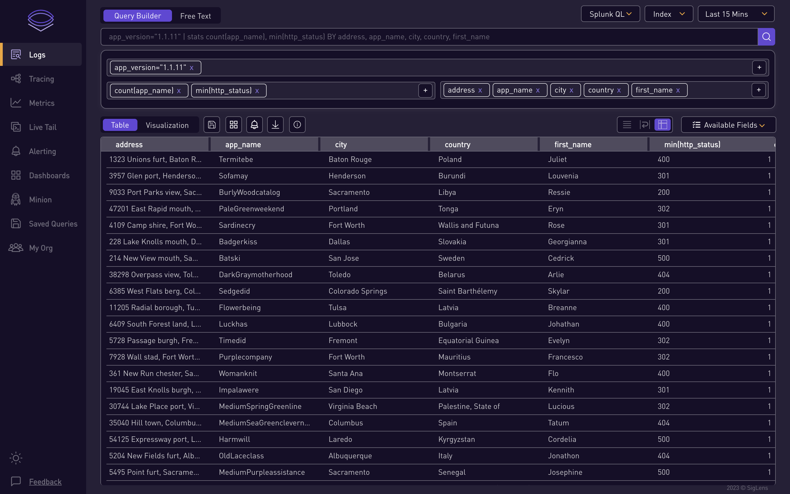

---

English | [简体中文](README_ZH_CN.md)

  

  
Open Source Observability that is 💥💥 <b>100x</b> 💥💥 more efficient than Splunk 

  
<b>Single binary</b> for Logs ğŸ¯, Metrics 🯠and Traces ğŸ¯.

  
Cut down your Splunk bill by ⚡ ⚡ <b>90%</b> ⚡ ⚡ 

# Why SigLens:
Our experience servicing 10,000+ engineers with Observability tools taught us a few things:

- Developers have to jump through different tools for logs, metrics, traces
- Splunk, DataDog, NewRelic are very expensive 💸 💸 💸 
- ElasticSearch takes too many machines, cluster maintenance is hard 👩‍💻👩‍💻
- Grafana Loki has slow query performance 🐌🐌

Armed with decades of experience in monitoring domain, we set out to build a observability DB from the ground up, uniquely suited for logs, metrics and traces with **`zero`** external dependencies. A **`single binary`** that you can run on your laptop and process **`8 TB/day`**.  
  

# Setup
## Installation

### &emsp; <a href="https://siglens.github.io/siglens-docs/installation/git" target="_blank">Git</a> &emsp; | &emsp; <a href="https://siglens.github.io/siglens-docs/installation/docker" target="_blank">Docker</a> &emsp;| &emsp; <a href="https://siglens.github.io/siglens-docs/installation/helm" target="_blank">Helm</a>

## Documentation
### &emsp; <a href="https://siglens.github.io/siglens-docs" target="_blank">Docs</a> &emsp;

# Differentiators

### SigLens v/s Splunk,Elastic,Loki  
Check out this <a href="https://www.siglens.com/blog/petabyte-of-observability-data.html" target="_blank">blog</a> where SigLens ingested data at 1 PB/day rate for 24 hours on a mere `32 EC2 instances` compared to `3000 EC2 instances` required for Splunk, Elastic, Grafana Loki

### SigLens v/s Elasticsearch 
Check out this <a href="https://www.siglens.com/blog/siglens-1025x-faster-than-elasticsearch" target="_blank">blog</a> where SigLens is **`1025x`** Faster than Elasticsearch 🚀🚀

### SigLens v/s ClickHouse 
Check out this <a href="https://www.siglens.com/blog/siglens-54x-faster-than-clickhouse.html" target="_blank">blog</a> where SigLens is **`54x`** Faster than ClickHouse 🚀🚀

 

# Features:

1. Multiple Ingestion formats: Open Telemetry, Elastic, Splunk HEC, Loki
2. Multiple Query Languages: Splunk SPL, SQL and Loki LogQL
3. Simple architecture, easy to get started.

## Join our Community

Have questions, ask them in our community <a href="https://www.siglens.com/slack" target="_blank">Slack</a> 👋

 

# Contributing

Please read [CONTRIBUTING.md](CONTRIBUTING.md) to get started with making contributions to SigLens.

# How-Tos

#### Searching Logs

#### Creating Dashboards

#### Creating Alerts

#### Live Tail

#### Minion Searches

## Code of Conduct
Please review our [code of conduct](https://github.com/siglens/siglens?tab=coc-ov-file#siglens-code-of-conduct) before contributing.

  

## Thanks to all contributors for their efforts

