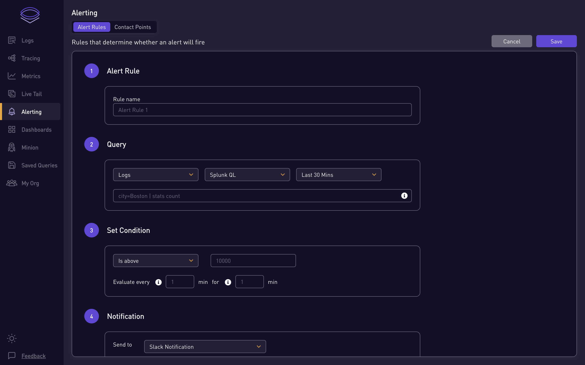
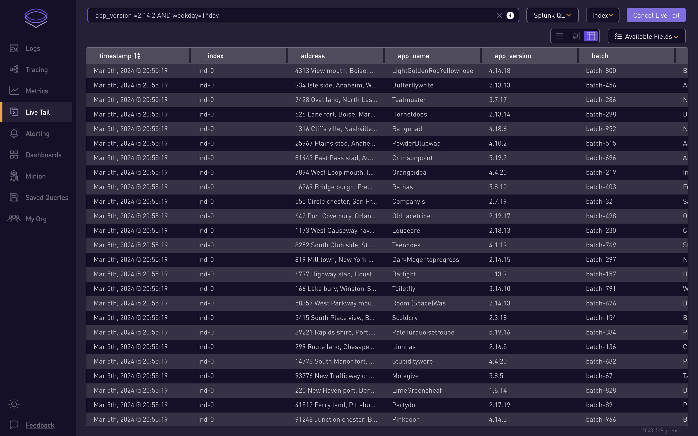

# SigLens

SigLens 是一个开源的，能够解决可观测性问题的方案，它比 Splunk 和 Elastic 高效 **100 倍**。

## 为什么选择 SigLens：
为 10,000 多名工程师提供可观测性工具的经验教会了我们一些事情：

- 开发人员不得不在各种的工具之间切换以查看 logs, metrics 和 traces
- Splunk、DataDog、NewRelic 的费用非常昂贵
- ElasticSearch 需要太多的机器，集群维护比较困难
- Grafana Loki 的查询性能较慢

凭借几十年的监控领域经验，我们着手开始构建一个全新的，专为 logs, metrics 和 traces 而设计的，并且具有**零外部依赖**的可观测性数据库。它只需要一个**单一的二进制文件**，就可以在您的笔记本电脑上运行，并且能够每天处理高达 8 TB 的数据。

<br /><br />

## 加入我们的 Slack 社区
在 [Slack](https://www.siglens.com/slack) 上和我们打个招呼吧 👋

<br /><br />

## 入门

### 通过 Git 安装
```
git clone git@github.com:siglens/siglens
cd siglens
go run cmd/siglens/main.go --config server.yaml
```

### 通过 SigLens 二进制文件安装

待定

### 通过 Docker 安装

- SigLens 可以安装在 Linux 或 macOS 机器上
- 在 macOS 上安装时，请在运行脚本之前安装 Docker 引擎
- 克隆 SigLens 仓库并进入 siglens 目录

```
    git@github.com:siglens/siglens.git
    cd siglens
```

- 运行 `install_with_docker.sh` 脚本：

```
    ./install_with_docker.sh
```

SigLens 后端独立部署于 UI。 为了允许 UI 连接到后端，可以使用 docker network

```
    wget "https://github.com/siglens/siglens/releases/download/${SIGLENS_VERSION}/server.yaml"
    docker pull siglens/siglens:${SIGLENS_VERSION} 
    mkdir data
    docker run -it --mount type=bind,source="$(pwd)"/data,target=/siglens/data \
        --mount type=bind,source="$(pwd)"/server.yaml,target=/siglens/server.yaml \
        -p 8081:8081 -p 80:80 siglens/siglens:${SIGLENS_VERSION}
```

为了能够在重新启动后查询数据，请设置 `server.yaml` 中的 `ssInstanceName` 

`data` 目录挂载的目标路径应和 `server.yaml` 中的 `dataPath` 配置相同。

# 特点：

1. 支持多种数据引入格式(Ingestion formats)：Open Telemetry, Elastic, Splunk HEC, Loki
2. 支持多种查询语言：Splunk SPL, SQL 和 Loki LogQL
3. 架构简单，易于上手

# 优势

### SigLens v/s Elasticsearch

SigLens 比 Elasticsearch 快 **8 倍**，详情请查看这篇 [博客(英文)](https://www.sigscalr.io/blog/sigscalr-vs-elasticsearch.html)

### SigLens v/s ClickHouse

SigLens 比 ClickHouse 快 **4 ~ 37 倍**，详情请查看这篇 [博客(英文)](https://www.sigscalr.io/blog/sigscalr-vs-clickhouse.html)

### SigLens v/s Splunk,Elastic,Loki

SigLens 仅使用 **32 个 EC2 实例** 便可以 1 PB/天 的速率引入数据(ingest data)，而 Splunk、Elastic、Grafana Loki 需要 **3000 个 EC2 实例**，详情请查看这篇 [博客(英文)](https://www.sigscalr.io/blog/petabyte-of-observability-data.html)

# 贡献

开始贡献之前请阅读 [CONTRIBUTING.md (英文)](CONTRIBUTING.md) 。

# 可用性

#### 搜索日志(Searching Logs)


#### 创建仪表盘(Creating Dashboards)


#### 创建警报(Creating Alerts)



#### 实时追踪(Live Tail)



#### 监测搜索(Minion Searches)


## 行为准则

待定
