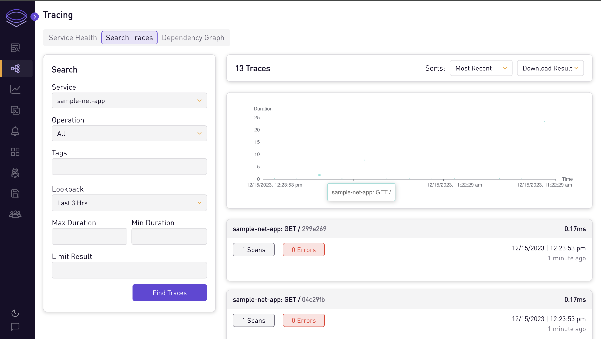
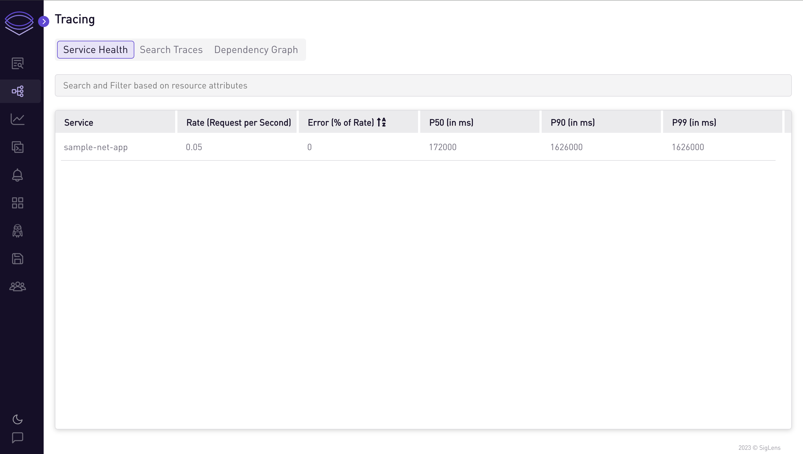
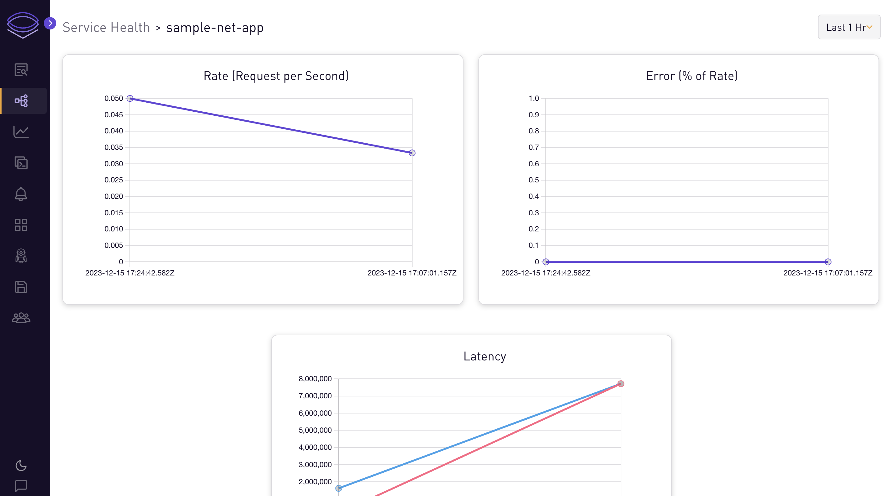
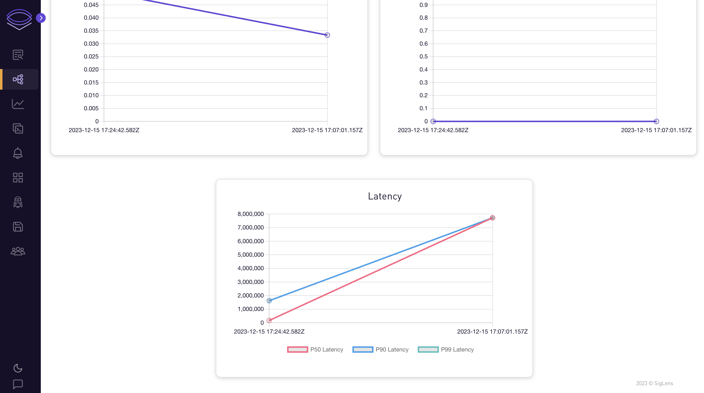

# .NET App

## Auto-instrument sample .NET App for traces

In this tutorial, we will go through the steps to auto-instrument a .NET app to send traces to Siglens.

## Prerequisites

- You need to have the .NET SDK installed. You can install `dotnet` using a package manager like homebrew or download it [here](https://dotnet.microsoft.com/en-us/download/dotnet).

## Quickstart

Start SigLens:

```bash
curl -L https://siglens.com/install.sh | sh
```

Setup a .NET app:

```bash
mkdir dotnet-example
cd dotnet-example
dotnet new web
```

Replace the default `Program.cs`:

```bash
echo 'using OpenTelemetry.Exporter;
using OpenTelemetry.Trace;

var builder = WebApplication.CreateBuilder(args);

builder.Services.AddOpenTelemetry()
    .WithTracing(tracing => tracing
        .AddAspNetCoreInstrumentation()
        .AddOtlpExporter()
    );

var app = builder.Build();

app.MapGet("/", () => "Hello World!");

app.Run();' > Program.cs
```

Replace the default `Properties/launchSettings.json`:

```bash
echo '{
  "$schema": "http://json.schemastore.org/launchsettings.json",
  "profiles": {
    "http": {
      "commandName": "Project",
      "dotnetRunMessages": true,
      "launchBrowser": true,
      "applicationUrl": "http://localhost:8080",
      "environmentVariables": {
        "ASPNETCORE_ENVIRONMENT": "Development"
      }
    }
  }
}' > Properties/launchSettings.json
```

Install OpenTelemetry dependencies:

```bash
dotnet add package OpenTelemetry
dotnet add package OpenTelemetry.Exporter.OpenTelemetryProtocol
dotnet add package OpenTelemetry.Extensions.Hosting
dotnet add package OpenTelemetry.Instrumentation.Runtime
dotnet add package OpenTelemetry.Instrumentation.AspNetCore
dotnet add package OpenTelemetry.AutoInstrumentation
```

Run the app:

```bash
OTEL_METRICS_EXPORTER=none \
OTEL_LOGS_EXPORTER=none \
OTEL_EXPORTER_OTLP_ENDPOINT="http://localhost:8081/otlp" \
OTEL_EXPORTER_OTLP_PROTOCOL="http/protobuf" \
OTEL_SERVICE_NAME="my-service" \
dotnet run
```

Go to the app at http://localhost:8080 and refresh the page a few times (you should see `Hello World!`) to send traces to SigLens.
After about 10 seconds, you should see the traces on SigLens on http://localhost:5122 then going to Tracing -> Search Traces and clicking the Find Traces button.

## More Details

For auto-instrumenting your own .NET app, you'll follow a similar procedure.
In particular, you will:

1. Add the following to your program:

```csharp
using OpenTelemetry.Exporter;
using OpenTelemetry.Trace;

var builder = WebApplication.CreateBuilder(args);

builder.Services.AddOpenTelemetry()
    .WithTracing(tracing => tracing
        .AddAspNetCoreInstrumentation()
        .AddOtlpExporter()
    );

var app = builder.Build();
```

2. Install OpenTelemetry dependencies into your project:

```bash
dotnet add package OpenTelemetry
dotnet add package OpenTelemetry.Exporter.OpenTelemetryProtocol
dotnet add package OpenTelemetry.Extensions.Hosting
dotnet add package OpenTelemetry.Instrumentation.Runtime
dotnet add package OpenTelemetry.Instrumentation.AspNetCore
dotnet add package OpenTelemetry.AutoInstrumentation
```

3. Run your app using OTEL environment variables:

```bash
OTEL_METRICS_EXPORTER=none \
OTEL_LOGS_EXPORTER=none \
OTEL_EXPORTER_OTLP_ENDPOINT="http://localhost:8081/otlp" \
OTEL_EXPORTER_OTLP_PROTOCOL="http/protobuf" \
OTEL_SERVICE_NAME="my-service" \
dotnet run
```

Once you're on the Tracing tab of SigLens, you can search the traces and see health metrics and graphs for each service.







