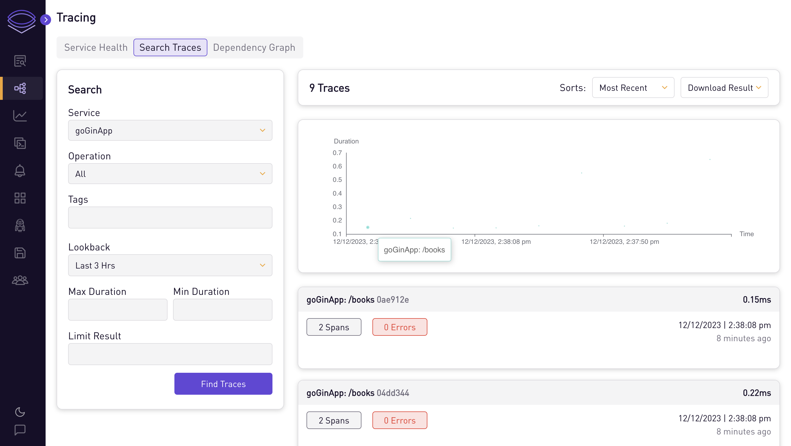
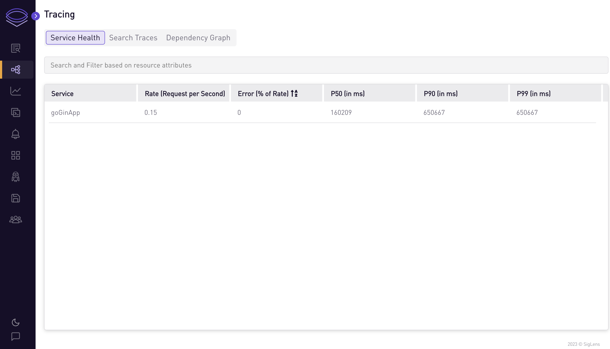
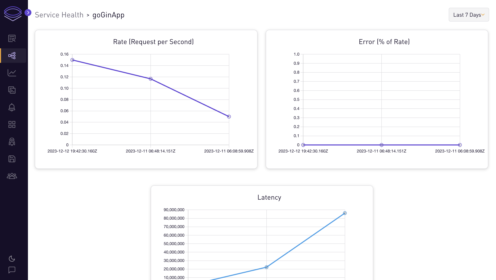
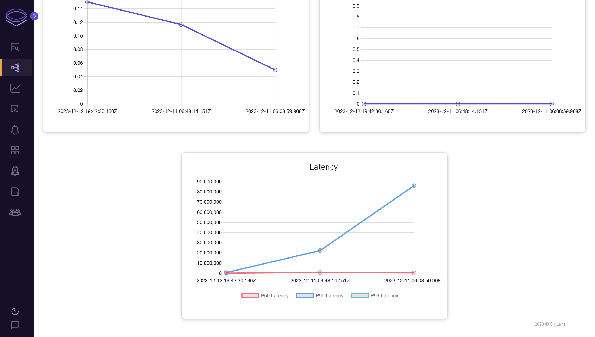

# Go App

## Auto-instrument sample Golang app for traces

In this tutorial, we will go through the steps to auto-instrument a Go app to send traces to SigLens.

## Quickstart
Start SigLens:
```bash
curl -L https://siglens.com/install.sh | sh
```

Start a Go app in a separate terminal:
```bash
git clone https://github.com/siglens/bookstore-app.git
cd bookstore-app
SERVICE_NAME=my-service OTEL_EXPORTER_OTLP_ENDPOINT=http://localhost:8081/otlp go run main.go
```

Go to the bookstore app at http://localhost:8090/books and refresh the page a few times (you should see `{"data":[]}`) to send traces to SigLens.
After about 10 seconds, you should see the traces on SigLens on http://localhost:5122 then going to Tracing -> Search Traces and clicking the Find Traces button.

## More Details
Instrumenting your existing Go app to send traces to SigLens requires a few extra steps becasue OpenTelemetry doesn't yet have full auto-instrumentation for Go.
Let's say you have an app that uses the [Gin](https://gin-gonic.com/) framework.
Here's how you would use the `otelgin` package to instrument the `gin` calls:

1. In your `main.go`, update your imports section:
```golang
import (
    // Existing imports ...

    "go.opentelemetry.io/contrib/instrumentation/github.com/gin-gonic/gin/otelgin"
    "go.opentelemetry.io/otel"
    "go.opentelemetry.io/otel/attribute"
    "go.opentelemetry.io/otel/exporters/otlp/otlptrace"
    "go.opentelemetry.io/otel/exporters/otlp/otlptrace/otlptracehttp"
    "go.opentelemetry.io/otel/sdk/resource"
    sdktrace "go.opentelemetry.io/otel/sdk/trace"
)
```

2. Setup an `initTracing()` function in your `main.go`:
```golang
var (
	serviceName = os.Getenv("SERVICE_NAME")
)

func initTracing() func(context.Context) error {

	exporter, err := otlptrace.New(
		context.Background(),
		otlptracehttp.NewClient(),
	)

	if err != nil {
		log.Fatalf("Failed to create exporter: %v", err)
	}

	resources, err := resource.New(
		context.Background(),
		resource.WithAttributes(
			attribute.String("service.name", serviceName),
			attribute.String("library.language", "go"),
		),
	)

	if err != nil {
		log.Fatalf("Could not set resources: %v", err)
	}

	otel.SetTracerProvider(
		sdktrace.NewTracerProvider(
			sdktrace.WithSampler(sdktrace.AlwaysSample()),
			sdktrace.WithBatcher(exporter),
			sdktrace.WithResource(resources),
		),
	)
	return exporter.Shutdown
}
```

3. Call your new `initTracing()` in `main()`:

```golang
func main() {
    cleanup := initTracing()
    defer cleanup(context.Background())

    r := gin.Default()
    r.Use(otelgin.Middleware(serviceName))

    // Existing code ...
}
```

4. Run `go mod tidy` to download all the imported packages
5. Run the app:
```bash
SERVICE_NAME=my-service OTEL_EXPORTER_OTLP_ENDPOINT=http://localhost:8081/otlp go run main.go
```
6. Run SigLens in a different terminal
```bash
curl -L https://siglens.com/install.sh | sh
```
7. Go to the bookstore app at http://localhost:8090/books and refresh the page a few times (you should see `{"data":[]}`) to send traces to SigLens.
8. After about 10 seconds, you should see the traces on SigLens on http://localhost:5122 then going to Tracing -> Search Traces and clicking the Find Traces button.

Once you're on the Tracing tab of SigLens, you can search the traces and see health metrics and graphs for each service.









## Next Steps
Since OpenTelemetry doesn't yet support full auto-instrumentation for Go like it does for some other languages, how you instrument your app will depend on which packages you're currently using.
Checkout the [OpenTelemetry Registry](https://opentelemetry.io/ecosystem/registry/) to find packages for instrumenting your existing packages.