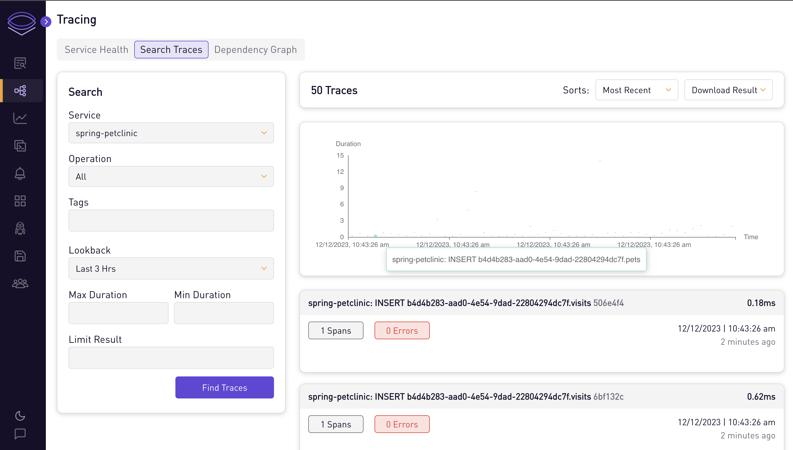
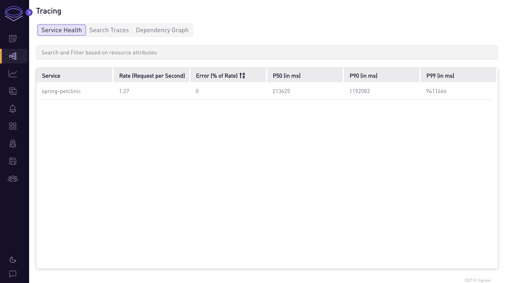
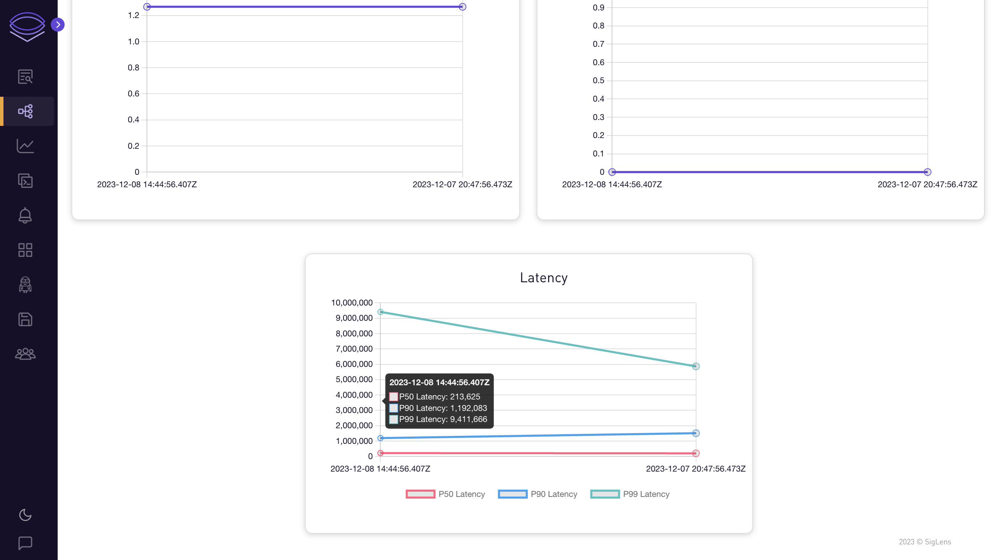

# Java App

## Auto-instrument sample Java app for traces

In this tutorial, we will go through the steps to auto-instrument a Java app to send traces to SigLens.

## Quickstart
Start SigLens:
```bash
curl -L https://siglens.com/install.sh | sh
```

Start a Java app in a separate terminal:
```bash
git clone https://github.com/spring-projects/spring-petclinic
cd spring-petclinic
./mvnw package
curl -L -O https://github.com/open-telemetry/opentelemetry-java-instrumentation/releases/latest/download/opentelemetry-javaagent.jar

OTEL_METRICS_EXPORTER=none \
OTEL_LOGS_EXPORTER=none \
OTEL_EXPORTER_OTLP_ENDPOINT="http://localhost:8081/otlp" \
OTEL_RESOURCE_ATTRIBUTES=service.name=my-service \
java -javaagent:opentelemetry-javaagent.jar -jar target/spring-petclinic-3.2.0-SNAPSHOT.jar
```

Go to the java app at http://localhost:8080 and use it a little to send traces to SigLens.
After about 10 seconds, you should see the traces on SigLens on http://localhost:5122 then going to Tracing -> Search Traces and clicking the Find Traces button.

## More Details
OpenTelemetry has full auto-instrumentation for Java, so auto-instrumenting your own Java app is easy.
Simply follow the Quickstart instructions to run SigLens and download opentelemetry-javaagent.jar, then run your app normally but add the opentelemetry-javaagent.jar and the OTEL environment variables as done in the Quickstart.

Once you're on the Tracing tab of SigLens, you can search the traces and see health metrics and graphs for each service.






