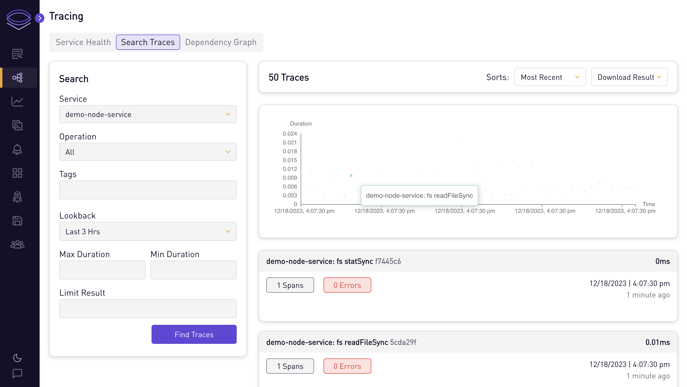
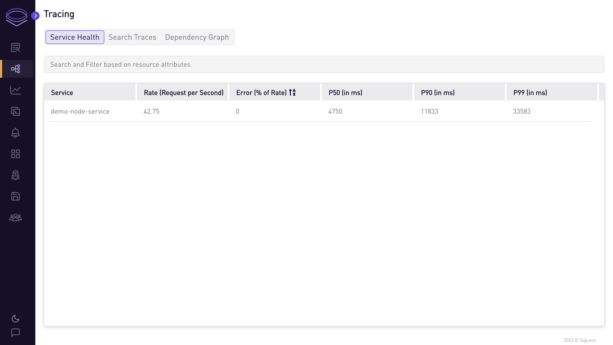
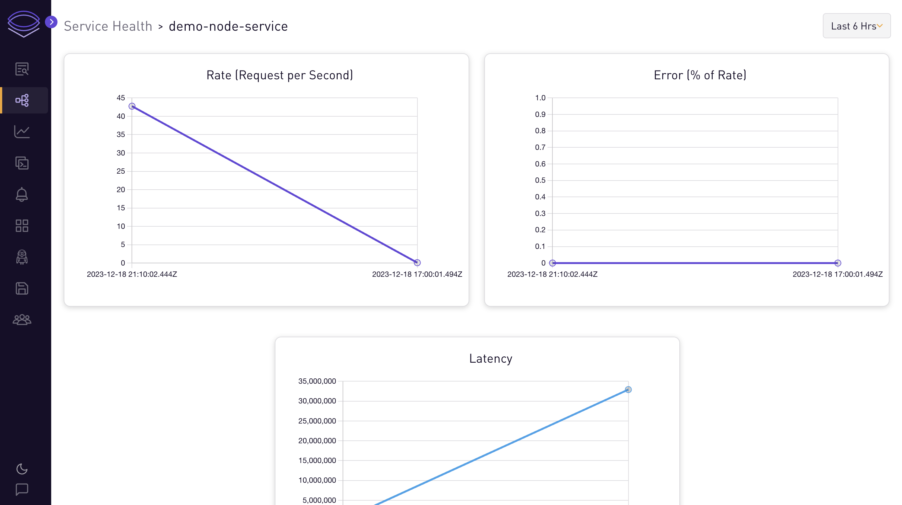
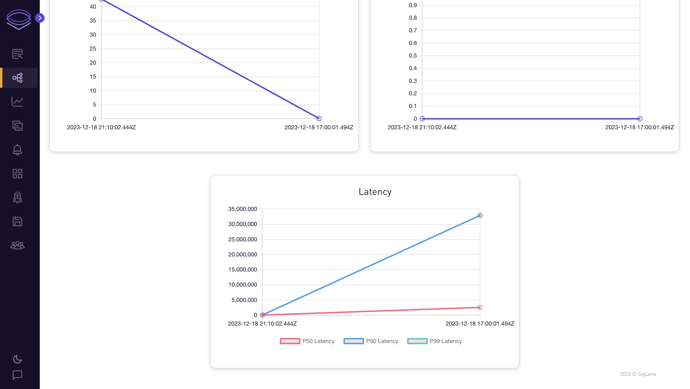

# Javascript App

## Auto-instrument sample Javascript app for traces

In this tutorial, we will go through the steps to auto-instrument a Javascript app to send traces to SigLens.

## Quickstart
Start SigLens:
```bash
curl -L https://siglens.com/install.sh | sh
```

Install instrumentation tools from OpenTelemetry:
```bash
npm install --save @opentelemetry/api
npm install --save @opentelemetry/auto-instrumentations-node
```

Run a JavaScript app in a separate terminal:
```bash
git clone https://github.com/dockersamples/helloworld-demo-node
cd helloworld-demo-node

OTEL_LOGS_EXPORTER=none \
OTEL_METRICS_EXPORTER=none \
OTEL_EXPORTER_OTLP_ENDPOINT="http://localhost:8081/otlp" \
OTEL_SERVICE_NAME="my-service" \
NODE_OPTIONS="--require @opentelemetry/auto-instrumentations-node/register" \
node app.js
```

Go to the app at http://localhost:8080 and refresh the page a few times (you should see the docker whale) to send traces to SigLens.
After about 10 seconds, you should see the traces on SigLens on http://localhost:5122 then going to Tracing -> Search Traces and clicking the Find Traces button.

## More Details
OpenTelemetry has full auto-instrumentation for JavaScript, so auto-instrumenting your own JavaScript app is easy.
Simply follow the Quickstart instructions but replace the example JavaScript repo with your own.

Once you're on the Tracing tab of SigLens, you can search the traces and see health metrics and graphs for each service.







