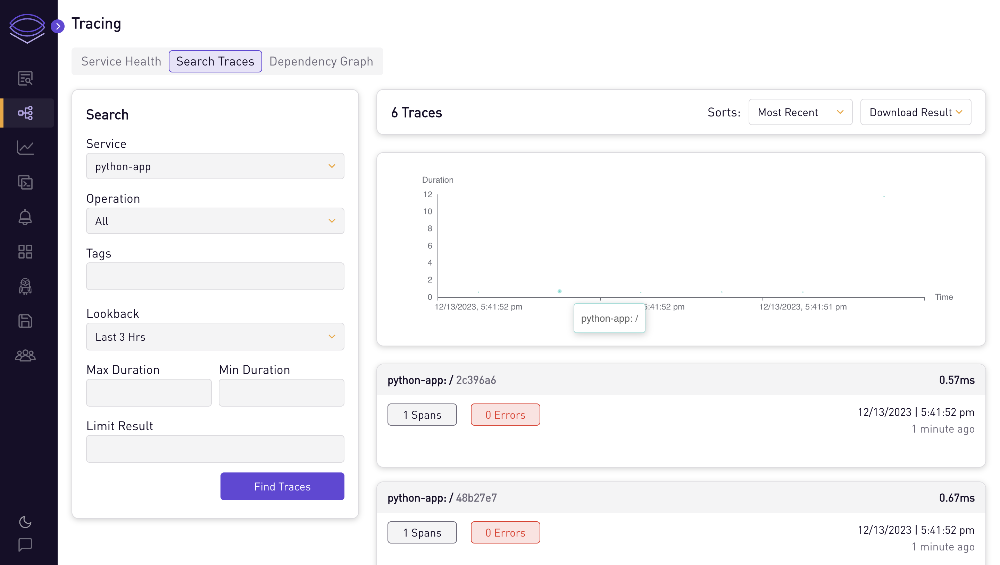
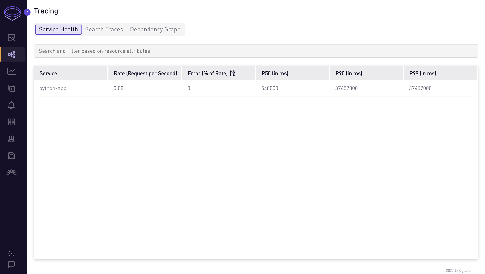
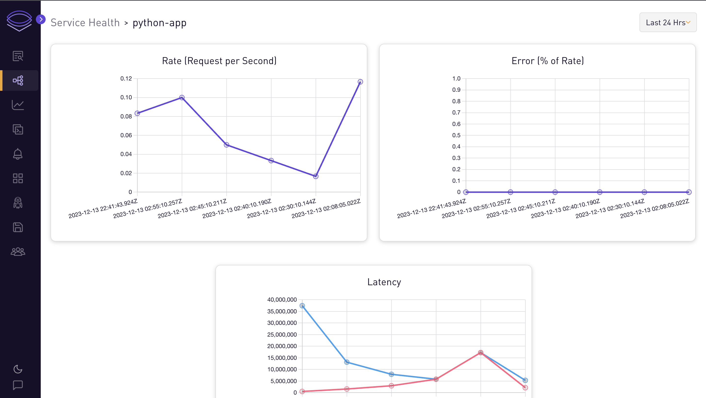
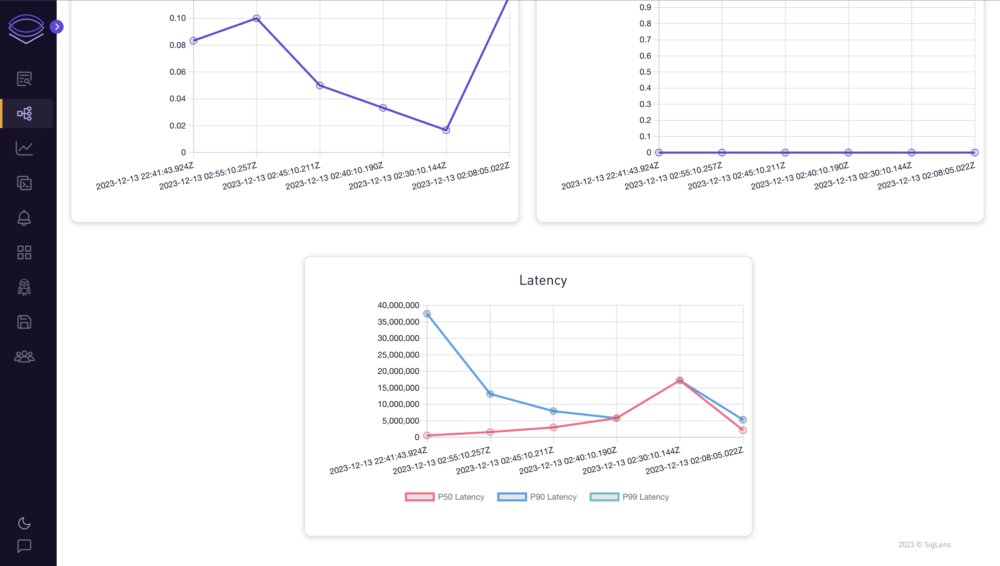

# Python App

## Auto-instrument sample Python app for traces

In this tutorial, we will go through the steps to auto-instrument a Python app to send traces to SigLens.
Follow along with the [Django Quickstart](#django-quickstart) or [Flask Quickstart](#flask-quickstart) to quickly get an app sending traces to SigLens, then checkout [More Details](#more-details) for more information on getting your existing app to send traces to SigLens.

## Django Quickstart

Start SigLens:

```bash
curl -L https://siglens.com/install.sh | sh
```

Setup a simple Python app:

```bash
git clone https://github.com/docker/awesome-compose.git
cd awesome-compose/django/app
python3 -m venv django
source django/bin/activate
pip install -r requirements.txt
```

Install packages for OpenTelemetry Python development:

```bash
pip install opentelemetry-exporter-otlp-proto-http
pip install opentelemetry-distro
opentelemetry-bootstrap -a install
```

Install packages for OpenTelemetry Python development with Django:

```bash
pip install opentelemetry-instrumentation-django
```

Run with OpenTelemetry auto-instrumentation:

```bash
DJANGO_SETTINGS_MODULE=example.settings \
OTEL_LOGS_EXPORTER=none \
OTEL_METRICS_EXPORTER=none \
OTEL_EXPORTER_OTLP_ENDPOINT="http://localhost:8081/otlp" \
OTEL_EXPORTER_OTLP_PROTOCOL="http/protobuf" \
OTEL_SERVICE_NAME="my-service" \
opentelemetry-instrument python3 manage.py runserver --noreload
```

Go to the app at http://localhost:8000 and refresh the page a few times (you should see `The install worked successfully! Congratulations!`) to send traces to SigLens.
After about 10 seconds, you should see the traces on SigLens on http://localhost:5122 then going to Tracing -> Search Traces and clicking the Find Traces button.

## Flask Quickstart

Start SigLens:

```bash
curl -L https://siglens.com/install.sh | sh
```

Setup a simple Python app:

```bash
git clone https://github.com/helloflask/flask-examples.git
cd flask-examples/hello
python3 -m venv flask
source flask/bin/activate
```

Install packages for OpenTelemetry Python development:

```bash
pip install opentelemetry-exporter-otlp-proto-http
pip install opentelemetry-distro
opentelemetry-bootstrap -a install
```

Install packages for OpenTelemetry Python development with Flask:

```bash
pip install 'flask<3' 'werkzeug<3'
pip install opentelemetry-instrumentation-flask
```

Run with OpenTelemetry auto-instrumentation:

```bash
OTEL_LOGS_EXPORTER=none \
OTEL_METRICS_EXPORTER=none \
OTEL_EXPORTER_OTLP_ENDPOINT="http://localhost:8081/otlp" \
OTEL_EXPORTER_OTLP_PROTOCOL="http/protobuf" \
OTEL_SERVICE_NAME="my-service" \
opentelemetry-instrument flask run -p 8080
```

Go to the app at http://localhost:8080 and refresh the page a few times (you should see `Hello, World!`) to send traces to SigLens.
After about 10 seconds, you should see the traces on SigLens on http://localhost:5122 then going to Tracing -> Search Traces and clicking the Find Traces button.

## More Details

To auto-instrument your own Flask or Django app, you'll follow a similar procedure as in the relevant Quickstart.
For a Python app using a different framework the process will be largely the same, but instead of installing `opentelemetry-instrumentation-flask` you'll install `opentelemetry-instrumentation-<package>`.
Check out the [OpenTelemetry Registry](https://opentelemetry.io/ecosystem/registry/) to find the appropriate package for instrumenting your Python app.

For Django specifically, you need to run the app with the `--noreload` flag, so something like `python3 manage.py runserver --noreload`. This lets OpenTelemetry properly instrument the app by disallowing Django from running `main` twice.

Once you're on the Tracing tab of SigLens, you can search the traces and see health metrics and graphs for each service.







